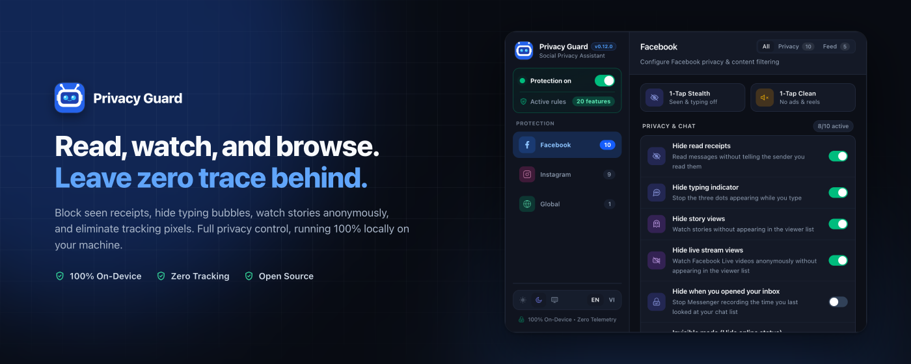
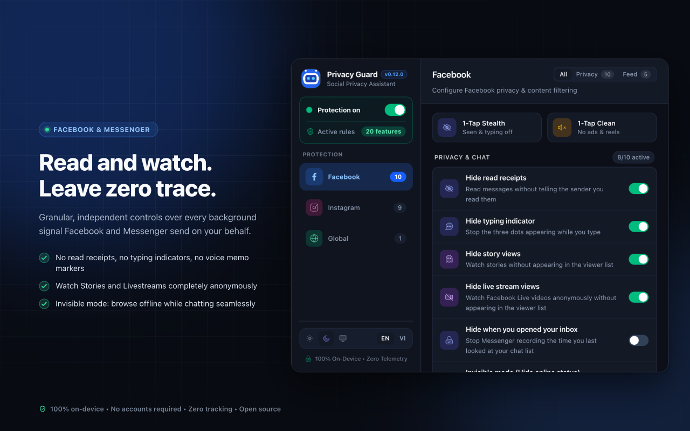
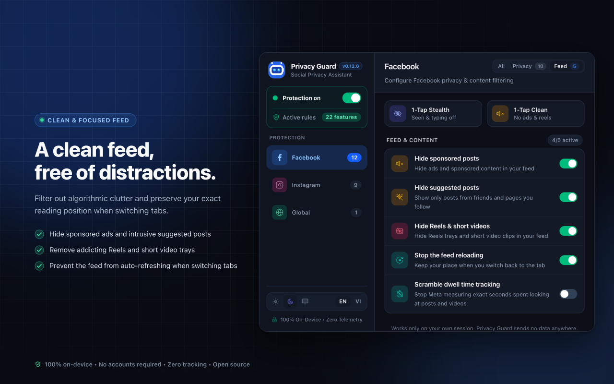
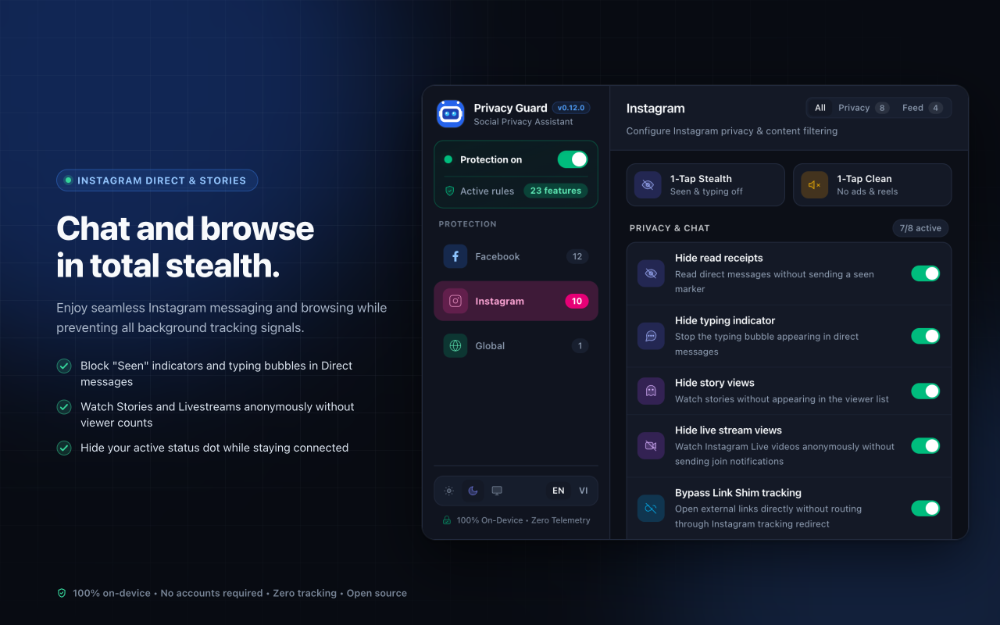
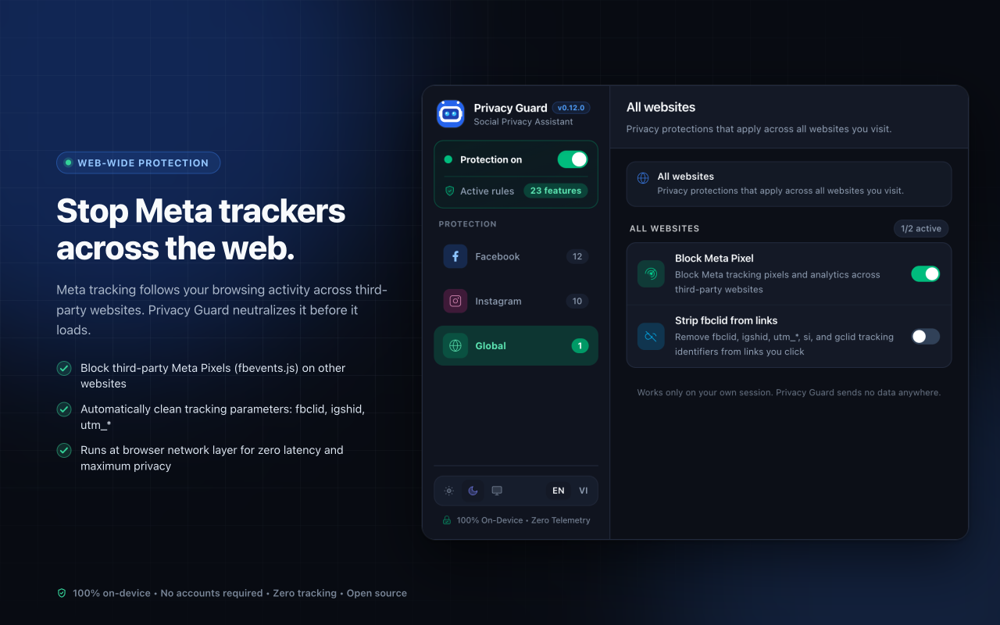
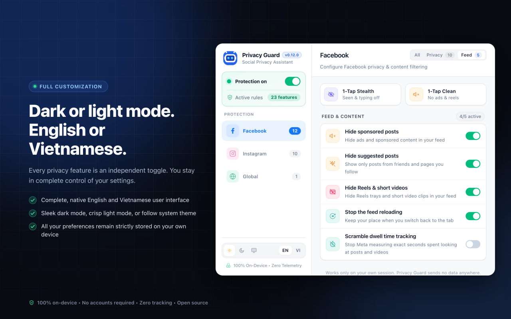

<p align="center">
  
</p>

<h1 align="center">Privacy Guard</h1>

<p align="center">
  <strong>Take back control of your privacy on Facebook, Messenger, and Instagram.</strong>
</p>

<p align="center">
  <em>Read messages without seen receipts, watch Stories & Livestreams anonymously, declutter your feed from ads & Reels, and block Meta tracking pixels across the web.</em>
</p>

<p align="center">
  <a href="https://github.com/Nam088/privacy-guard/actions/workflows/ci.yml"></a>
  <a href="https://github.com/Nam088/privacy-guard/releases"></a>
  <a href="https://chromewebstore.google.com/detail/privacy-guard/beplndkbpjhkdbnagabhdbjjfhjflhgn"></a>
  <a href="https://addons.mozilla.org/en-US/firefox/addon/privacy-guard-social/"></a>
  
  <a href="LICENSE"></a>
</p>

<p align="center">
  <strong>English</strong> • <a href="README.vi.md">Tiếng Việt</a>
</p>

<p align="center">
  <a href="https://chromewebstore.google.com/detail/privacy-guard/beplndkbpjhkdbnagabhdbjjfhjflhgn" target="_blank">
    
  </a>
  &nbsp;
  <a href="https://addons.mozilla.org/en-US/firefox/addon/privacy-guard-social/" target="_blank">
    
  </a>
</p>

<p align="center">
  
</p>

---

## Key Features

- **Ghost Mode for Messages**: Read incoming messages on Facebook Messenger and Instagram Direct without triggering the "Seen" indicator. Hide the typing bubble while composing messages.
- **Anonymous Stories & Live**: Watch Stories and Livestreams without your name appearing on viewer lists or notifying creators.
- **Stealth Search**: Search profiles, pages, and hashtags without leaving entries in your search history or polluting your recommendation algorithm.
- **Feed Declutter**: Eliminate sponsored ads, suggested content, and Reels trays. Prevent accidental feed auto-refreshing when switching tabs.
- **Web-Wide Tracking Defense**: Block third-party Meta Pixels (`fbevents.js`) across the web and automatically strip tracking parameters (`fbclid`, `igshid`, `utm_*`) from outbound links.
- **100% On-Device & Zero Data Collection**: Runs entirely locally within your browser. No backend servers, no analytics, and no accounts required.

---

## Get Extension

Install Privacy Guard directly from official browser extension stores:

| Browser | Supported Platform | Status | Download Link |
| :--- | :--- | :---: | :---: |
| **Google Chrome** | Chrome Web Store | Official | [Install for Chrome](https://chromewebstore.google.com/detail/privacy-guard/beplndkbpjhkdbnagabhdbjjfhjflhgn) |
| **Microsoft Edge** | Chromium Add-ons | Compatible | [Install for Edge](https://chromewebstore.google.com/detail/privacy-guard/beplndkbpjhkdbnagabhdbjjfhjflhgn) |
| **Brave / Opera** | Chromium Extension Store | Compatible | [Install from CWS](https://chromewebstore.google.com/detail/privacy-guard/beplndkbpjhkdbnagabhdbjjfhjflhgn) |
| **Mozilla Firefox** | Firefox Browser Add-ons (AMO) | Official | [Install for Firefox](https://addons.mozilla.org/en-US/firefox/addon/privacy-guard-social/) |
| **Manual / Offline** | GitHub Releases | Open Source | [Download (.zip / .xpi)](https://github.com/Nam088/privacy-guard/releases) |

---

## App Preview

| **Facebook & Messenger Privacy** | **Feed Declutter** |
| :---: | :---: |
|  |  |
| **Instagram Direct & Stories** | **Global Tracker Defense** |
|  |  |

<p align="center">
  
</p>

---

## Why Privacy Guard?

Traditional ad-blockers only block basic web URLs. They are blind to modern social web applications operating over persistent binary streams and real-time internal protocols:

| Protection Capability | Standard Ad Blockers | Privacy Guard |
| :--- | :---: | :---: |
| Block External Meta Pixels (`fbevents.js`) | Yes | Yes |
| Strip Tracking Links & Bypass Redirects | Partial | Full Link Shim Unwrap |
| Hide "Seen" / Read Receipts in Chats | No | Full Protection (including E2EE) |
| Hide Typing Indicators ("...") | No | Supported |
| Watch Stories & Livestreams Anonymously | No | 100% Anonymous |
| Zero-Trace Search History | No | No Search History Skews |
| Block Dwell-Time Profiling | No | Scrambles Telemetry Beacons |
| Prevent WebRTC IP Address Leaks | No | ICE Candidate Shield |
| 100% Local Processing & Open Source | Varies | Verified GPLv3 |

---

## Core Capabilities

### Messaging & Social Privacy
- **Ghost Read Receipts**: Read incoming messages on Messenger and Instagram Direct without sending a seen marker. Works across standard chats, group chats, and end-to-end encrypted conversations.
- **Typing Indicator Shield**: Never show the 3 typing dots while you draft messages in popups, full-screen chats, or Direct.
- **Invisible Mode**: Stay completely invisible without the active green dot, while continuing to send and receive messages normally.
- **Anonymous Story & Live Viewing**: View friend stories and watch live streams without leaving your name on the viewer list or notifying the creator.
- **WebRTC IP Leak Shield**: Prevent your real IP address (both local and public) from leaking during peer-to-peer audio and video calls.
- **Voice Note Playback Shield**: Listen to voice memos on Messenger without notifying the sender that the audio was played.

### Clean & Focused Feed
- **Hide Sponsored Posts & Ads**: Eliminate paid advertising and sponsored promos from your feed.
- **Hide Suggested Posts**: Remove algorithmic recommendations ("Suggested for you") to see only updates from friends and pages you choose to follow.
- **Hide Reels & Short Videos**: Hide addicting video carousels and short-video shelves to keep your focus intact.
- **Stop Feed Auto-Reload**: Keep your reading position intact when switching between browser tabs.

### Global Web Anti-Tracking
- **Block Meta Pixels**: Prevent third-party websites from reporting your visit back to Meta advertising servers (`fbevents.js`).
- **Strip Link Tracking**: Automatically remove identifying query parameters (`fbclid`, `igshid`, `utm_*`, `gclid`) when following links.

---

## Privacy Guarantee

- **Runs 100% Locally**: All processing happens directly inside your browser. No backend servers, no proxies, no cloud dependencies.
- **Zero Data Collection**: No telemetry, no analytics, no user tracking. Your settings are stored in your browser's local storage and never leave your machine.
- **No Account Required**: Ready to use immediately upon installation. No registration, no passwords, no email collection.

---

## Development & Community

For developers who want to inspect, test, or contribute to Privacy Guard:

### Prerequisites
- **Node.js**: `v22.0.0` or higher
- **pnpm**: `v9.0.0` or higher

### Quick Start
```bash
git clone https://github.com/Nam088/privacy-guard.git
cd privacy-guard
pnpm install

# Start extension in development mode with hot-reload
pnpm dev             # Chrome / Chromium
pnpm dev:firefox     # Mozilla Firefox

# Run full verification suite (TypeScript, ESLint, Vitest)
pnpm compile && pnpm lint && pnpm test
```

For architecture diagrams and internal network protocols, see [`docs/ARCHITECTURE.md`](docs/ARCHITECTURE.md) and [`docs/PROTOCOL_MAPPING_GUIDE.md`](docs/PROTOCOL_MAPPING_GUIDE.md).

---

## License

This project is open source under the **[GNU General Public License v3.0 (GPLv3)](LICENSE)**.

> **Mandatory Source Code & Attribution Notice:**  
> Under the terms of the GNU GPLv3, anyone who modifies, adapts, or redistributes this software **must make the complete corresponding source code publicly available under the same GPLv3 license**, clearly **document all modifications**, and **preserve all original copyright and attribution notices**.

*Privacy Guard is an independent research project and is not affiliated with, endorsed by, or associated with Meta Platforms, Inc.*
