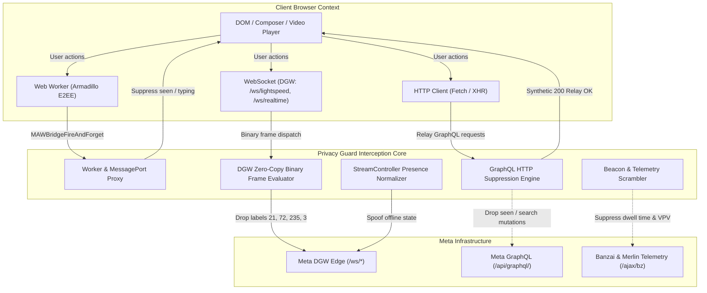

<p align="center">
  
</p>

<h1 align="center">Privacy Guard</h1>

<p align="center">
  <strong>Next-Generation Behavioral Stealth & Anti-Surveillance Extension for the Meta Ecosystem</strong>
</p>

<p align="center">
  <em>Comprehensive real-time telemetry suppression, WebSocket DGW binary filtering, Armadillo E2EE interception, and algorithmic isolation across Facebook, Messenger, and Instagram.</em>
</p>

<p align="center">
  <a href="https://github.com/Nam088/privacy-guard/actions/workflows/ci.yml"></a>
  <a href="https://github.com/Nam088/privacy-guard/releases"></a>
  
  
  
  
</p>

---

## 🌐 Table of Contents / Mục lục

- [Why Privacy Guard?](#-why-privacy-guard)
- [Architecture & Protocol Interception](#-architecture--protocol-interception)
- [Feature Matrix](#-feature-matrix)
- [English Documentation](#-english-documentation)
  - [Messaging & E2EE Privacy](#1-messaging--e2ee-privacy)
  - [Anonymous Browsing & Social Stealth](#2-anonymous-browsing--social-stealth)
  - [Feed Declutter & Recommendation Shield](#3-feed-declutter--recommendation-shield)
  - [Global Network Defense](#4-global-network-defense)
- [Tài Liệu Tiếng Việt](#-tài-liệu-tiếng-việt)
- [Development & Verification](#-development--verification)

---

## ⚡ Why Privacy Guard?

Traditional ad-blockers and privacy extensions operate on simplistic URL filtering rules (`declarativeNetRequest` / EasyList). However, Meta's modern web architecture (Comet on Facebook and Polaris on Instagram) multiplexes virtually all user interactions over persistent **binary WebSocket streams (Device Gateway / DGW)**, **Web Worker threads (Armadillo E2EE)**, and unified **GraphQL batch endpoints**.

Standard extensions are completely blind to these internal protocols. **Privacy Guard is purpose-built to inspect, parse, and selectively suppress telemetry at the transport and runtime layer without breaking normal app usage:**

| Capability | Traditional Ad Blockers | Privacy Guard |
| :--- | :---: | :---: |
| Block External Meta Pixels (`fbevents.js`) | ✅ | ✅ |
| Strip `fbclid` / tracking redirects | ⚠️ Partial | ✅ Full Link Shim unwrap |
| Intercept DGW WebSocket binary frames (`/ws/lightspeed`, `/ws/realtime`) | ❌ Blind | ✅ Zero-copy binary parser |
| Suppress E2EE Read Receipts in Armadillo Web Workers | ❌ Blind | ✅ Worker bridge proxying |
| Watch Stories & Livestreams 100% Anonymously | ❌ Impossible | ✅ Synthetic Relay 200 spoofing |
| Zero-Trace Search History (prevent recommendation skewing) | ❌ No | ✅ Intercepts typeahead mutations |
| Scramble Milisecond-level Dwell Time Tracking | ❌ No | ✅ Scrambles Merlin Protocol beacons |
| Native Multi-Browser (Chromium + Firefox Xray vision support) | ⚠️ Varied | ✅ 100% Cross-browser MV3 |

---

## 🏗️ Architecture & Protocol Interception

Privacy Guard uses a decoupled, event-driven defense-in-depth architecture:



---

## 📊 Feature Matrix

| Feature ID | Feature Name | Facebook | Instagram | Protection Level |
| :--- | :--- | :---: | :---: | :---: |
| `hideReadReceipts` | Ghost Read Receipts | ✅ | ✅ | WebSocket DGW + GraphQL + Armadillo E2EE |
| `hideTyping` | Typing Indicator Shield | ✅ | ✅ | WebSocket DGW + Composer State Bridge |
| `hideStoryViews` | Anonymous Story Viewing | ✅ | ✅ | GraphQL Seen State Mutation Drop |
| `hideLiveStreamViews` | Anonymous Live Stream Viewing | ✅ | ✅ | GraphQL Live Join Mutation Drop |
| `stealthSearch` | Stealth Search & Zero-Trace History | ✅ | ✅ | Typeahead Mutation Drop + Synthetic Relay OK |
| `hideOnlineStatus` | Invisible Mode (Hide Active Green Dot) | ✅ | ✅ | StreamController Presence Packet Modification |
| `protectWebRtcIp` | WebRTC IP Leak Shield | ✅ | ✅ | RTCPeerConnection ICE Candidate Filtering |
| `hideVoicePlayed` | Voice Note Playback Shield | ✅ | — | Playback Receipt Telemetry Drop |
| `hideInboxLastSeen` | Hide Inbox Opened Watermark | ✅ | ✅ | Thread 0 Root Watermark (Label 6) Drop |
| `scrambleDwellTime` | Scramble Dwell Time & Behavior Beacons | ✅ | ✅ | Merlin Unified Protocol & SendBeacon Scrambler |
| `bypassLinkShim` | Bypass Link Shim Tracking Redirect | ✅ | ✅ | DOM Event Hijacking + Direct URL Extraction |
| `hideSponsoredPosts` | Hide Sponsored Posts & Ads | ✅ | ✅ | Heuristic DOM MutationObserver Engine |
| `hideSuggestedPosts` | Clean Feed (Hide Algorithmic Suggestions) | ✅ | ✅ | Feed Shelf & Algorithmic Post Sanitizer |
| `hideReels` | Hide Reels & Short Video Trays | ✅ | ✅ | Feed Tray Elimination |
| `blockFeedAutoRefresh` | Block Background Feed Auto-Reload | ✅ | — | Document Visibility State Hook |
| `blockMetaPixel` | Block Third-Party Meta Tracking Pixels | ✅ | ✅ | DeclarativeNetRequest Rule (Global) |
| `stripFbclid` | Strip `fbclid`, `igshid`, `utm_*` Trackers | ✅ | ✅ | URL Search Parameter Sanitization (Global) |

---

<a name="english"></a>
## 🇬🇧 English Documentation

### 1. Messaging & E2EE Privacy
* **Ghost Read Receipts (`hideReadReceipts`)**: Read incoming messages on Facebook Messenger and Instagram Direct without triggering the "Seen" indicator. Intercepts read watermark frames (labels `21`, `72`, `235`) on WebSocket DGW endpoints (`/ws/lightspeed`, `/ws/realtime`), GraphQL mutations (`useReadReceiptMutation`, `MarkThreadReadMutation`), and Armadillo E2EE Web Worker threads.
* **Typing Indicator Shield (`hideTyping`)**: Completely prevents the animated three typing dots from appearing while you compose messages in chats, full-screen Messenger, and encrypted conversations. Filters `sendChatStateFromComposer` while preserving the idle state.
* **Invisible Mode / Hide Online Status (`hideOnlineStatus`)**: Browse Messenger and Instagram Direct without exposing your active status (the green dot). Transforms outgoing presence packets on `/ws/streamcontroller` to report an offline state while allowing incoming messages to be received instantly.
* **Inbox Opened Timestamp Shield (`hideInboxLastSeen`)**: Blocks the root-level watermark (label `6` with parent thread key `0`) sent when opening Messenger, preventing Meta from recording the exact time you checked your chat list.
* **Voice Note Playback Shield (`hideVoicePlayed`)**: Listen to received voice memos safely without alerting the sender that the audio file was played.

### 2. Anonymous Browsing & Social Stealth
* **Stealth Search & Zero-Trace History (`stealthSearch`)**: Search for profiles, pages, and tags on Facebook and Instagram without recording queries to your "Recent Searches" history or polluting Meta's recommendation algorithms. Drops `CometAddTypeaheadRecentSearchMutation` and `usePolarisRegisterInRecentSearchesMutation` with synthetic Relay 200 OK responses.
* **Anonymous Story Viewing (`hideStoryViews`)**: Watch Stories on Facebook and Instagram without your name appearing in the viewer list. Drops `storiesUpdateSeenStateMutation` and related GraphQL telemetry.
* **Anonymous Live Stream Viewing (`hideLiveStreamViews`)**: Watch Facebook Live videos and Instagram Livestreams without sending join notifications or appearing in the active viewer count.
* **WebRTC IP Leak Shield (`protectWebRtcIp`)**: Prevents local and public IP address exposure during Messenger and Instagram Direct voice/video calls by blocking non-proxied ICE candidate gathering.

### 3. Feed Declutter & Recommendation Shield
* **Scramble Dwell Time Tracking (`scrambleDwellTime`)**: Neutralizes Meta's millisecond-level telemetry (`comet_feed_dwell_time`, `feed_vpvd`, `PolarisSearchViewportLogRecentSearches`) via `/ajax/bz` and `/ws/realtime`, preventing algorithmic profiling based on viewing habits.
* **Bypass Link Shim Tracking (`bypassLinkShim`)**: Automatically strips Meta's tracking redirect (`l.facebook.com/l.php?u=...` and `lm.facebook.com`), opening external links directly with no tracking latency.
* **Hide Sponsored Posts (`hideSponsoredPosts`)**: Cleanses your feed of paid advertisements and sponsored promotions.
* **Hide Suggested Posts (`hideSuggestedPosts`)**: Removes algorithmically injected posts ("Suggested for you"), displaying updates exclusively from friends and pages you follow.
* **Hide Reels & Short Videos (`hideReels`)**: Strips Reels shelves and short video players from your feed to minimize distraction.
* **Stop Feed Auto-Reload (`blockFeedAutoRefresh`)**: Disables background page visibility hooks that cause Facebook to reload and lose your feed position when switching tabs.

### 4. Global Network Defense
* **Block Meta Tracking Pixels (`blockMetaPixel`)**: Blocks third-party tracking scripts (`fbevents.js`, `facebook.com/tr/`, `signals/`) across the web using declarativeNetRequest rules.
* **Strip Tracking Query Parameters (`stripFbclid`)**: Strips `fbclid`, `igshid`, `utm_*`, `si`, and `gclid` parameters when following links.

---

<a name="tieng-viet"></a>
## 🇻🇳 Tài Liệu Tiếng Việt

### 1. Quyền Riêng Tư & Bảo Mật Trò Chuyện
* **Chặn Đã Xem Tin Nhắn (`hideReadReceipts`)**: Đọc tin nhắn trên Facebook, Messenger và Instagram Direct mà không gửi thông báo "Đã xem" (Seen). Chặn triệt để các khung watermark (nhãn `21`, `72`, `235`) trên kênh WebSocket DGW (`/ws/lightspeed`, `/ws/realtime`), GraphQL mutation và Web Worker mã hóa đầu cuối Armadillo E2EE.
* **Chặn Đang Soạn Tin Nhắn (`hideTyping`)**: Triệt tiêu hoàn toàn bong bóng 3 chấm nhấp nháy khi bạn gõ bàn phím trong Messenger popup, Messenger toàn màn hình và Instagram Direct.
* **Chế Độ Tàng Hình / Ẩn Chấm Xanh Online (`hideOnlineStatus`)**: Lướt Facebook và Instagram mà không bao giờ hiện chấm xanh hoạt động. Gói tin presence trên `/ws/streamcontroller` được điều chỉnh về trạng thái offline ngầm.
* **Ẩn Thời Điểm Mở Hộp Thư (`hideInboxLastSeen`)**: Ngăn chặn Messenger ghi lại mốc thời gian bạn truy cập danh sách tin nhắn lần cuối.
* **Ẩn Đã Nghe Tin Nhắn Thoại (`hideVoicePlayed`)**: Nghe tin nhắn thoại mà đối phương không hề hay biết.

### 2. Lướt Web Ẩn Danh & Chống Lưu Vết
* **Tìm Kiếm Vô Danh / Không Lưu Lịch Sử (`stealthSearch`)**: Thoải mái tìm kiếm trang cá nhân, tài khoản, fanpage và hashtag mà **không bị lưu vào lịch sử tìm kiếm gần đây** và **không làm lệch thuật toán gợi ý feed/kết bạn**. Chặn đứng `CometAddTypeaheadRecentSearchMutation` và `usePolarisRegisterInRecentSearchesMutation`.
* **Xem Story Ẩn Danh (`hideStoryViews`)**: Xem toàn bộ Story của bạn bè trên Facebook và Instagram mà không xuất hiện tên trong danh sách người đã xem.
* **Xem Livestream Ẩn Danh (`hideLiveStreamViews`)**: Tham gia xem video phát trực tiếp trên Facebook và Instagram mà không gửi thông báo tham gia cho chủ phòng hoặc hiện tên trong danh sách khán giả.
* **Chống Rò Rỉ IP Qua WebRTC (`protectWebRtcIp`)**: Bảo vệ địa chỉ IP công cộng và IP mạng nội bộ khi gọi thoại/video trên Messenger và Instagram Direct.

### 3. Dọn Dẹp Bảng Tin & Kiểm Soát Thuật Toán
* **Chặn Đo Thời Gian Dừng Xem Dwell Time (`scrambleDwellTime`)**: Chặn Meta đo đạc số giây/mili-giây bạn dừng lại đọc từng bài viết, triệt tiêu cơ sở dữ liệu phân tích hành vi của thuật toán.
* **Bỏ Qua Chuyển Hướng Link Shim (`bypassLinkShim`)**: Mở trực tiếp các liên kết ra ngoài mà không phải đi qua máy chủ chuyển hướng theo dõi của Meta (`l.facebook.com`), tăng tốc độ mở web và bảo vệ quyền riêng tư.
* **Ẩn Bài Viết Được Tài Trợ (`hideSponsoredPosts`)**: Tự động lọc sạch toàn bộ quảng cáo và bài viết tài trợ trên bảng tin.
* **Ẩn Bài Viết Thuật Toán Gợi Ý (`hideSuggestedPosts`)**: Chỉ hiển thị bài viết từ bạn bè và các trang bạn chủ động theo dõi.
* **Ẩn Reels & Video Ngắn (`hideReels`)**: Loại bỏ hoàn toàn các khay Thước phim/Reels gây nghiện và xao nhãng.
* **Chặn Tự Động Tải Lại Bảng Tin (`blockFeedAutoRefresh`)**: Giữ nguyên vị trí bài viết bạn đang đọc dở khi chuyển tab quay lại.

### 4. Phòng Thủ Toàn Cầu
* **Chặn Mã Theo Dõi Meta Pixel (`blockMetaPixel`)**: Ngăn chặn mã theo dõi Meta Pixel trên các website bên ngoài.
* **Gọt Bỏ Tham Số Theo Dõi URL (`stripFbclid`)**: Tự động loại bỏ `fbclid`, `igshid`, `utm_*`, `si`, `gclid` khi click vào các liên kết.

---

## 🛠️ Development & Verification

### Prerequisites
- **Node.js**: `v22.0.0` or higher
- **pnpm**: `v9.0.0` or higher

### Installation
```bash
git clone https://github.com/Nam088/privacy-guard.git
cd privacy-guard
pnpm install
```

### Development Server
```bash
# Launch Chrome / Chromium with extension hot-reloaded
pnpm dev

# Launch Firefox in isolated development mode
pnpm dev:firefox
```

### Production Build
```bash
# Compile and package for all target browsers simultaneously
pnpm build:all

# Output directories:
# ├── .output/chrome-mv3    (Google Chrome, Brave, Opera)
# ├── .output/edge-mv3      (Microsoft Edge)
# └── .output/firefox-mv3   (Mozilla Firefox)
```

### Comprehensive Verification Suite
Every change must pass our strict verification standards:
```bash
pnpm compile    # TypeScript strict type check (tsc --noEmit)
pnpm lint       # ESLint static analysis
pnpm test       # Vitest unit test suite (57 test suites, 570+ assertions)
```

---

## 📄 License

This project is licensed under the [MIT License](LICENSE).
Privacy Guard is an independent research project and is not affiliated with, endorsed by, or associated with Meta Platforms, Inc.
