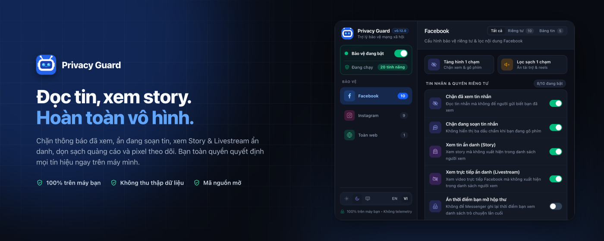
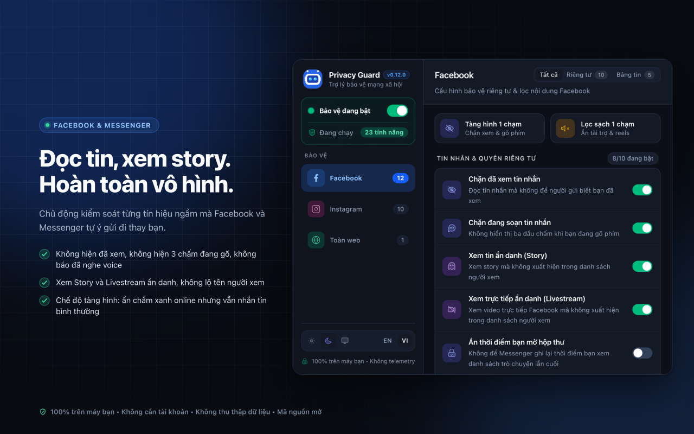
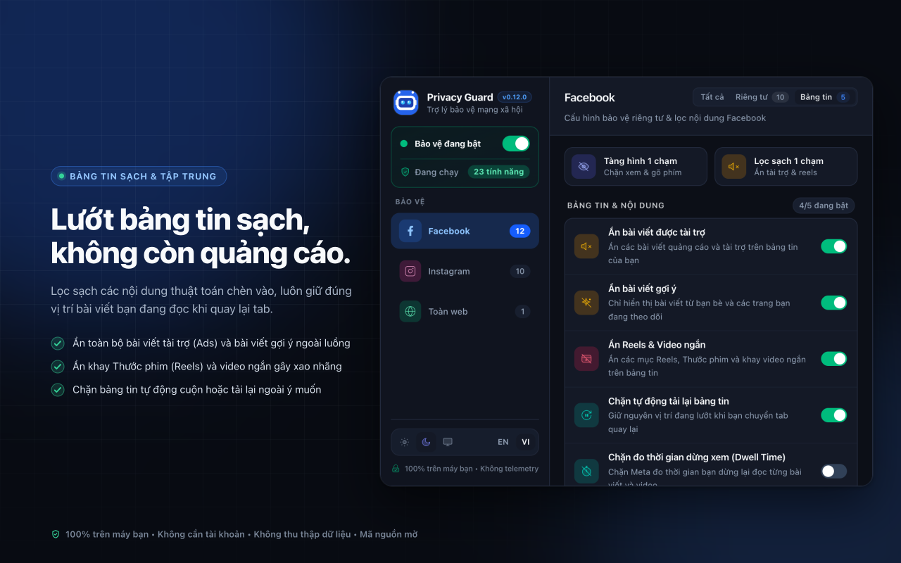
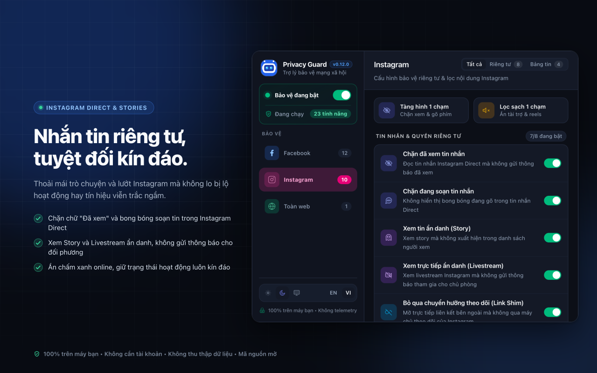
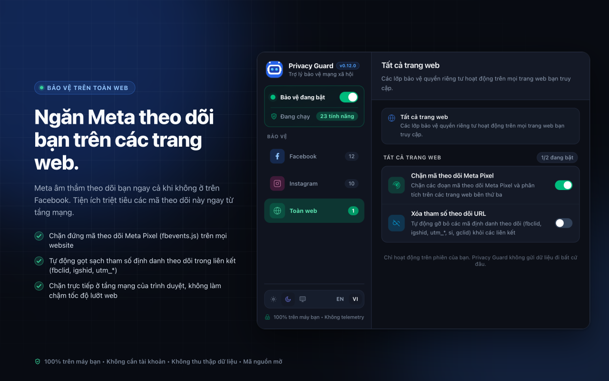
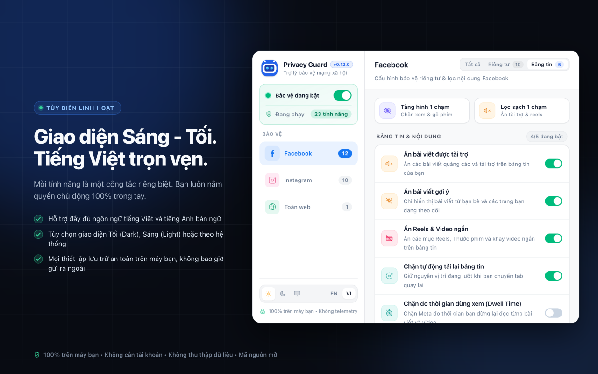

<p align="center">
  
</p>

<h1 align="center">Privacy Guard</h1>

<p align="center">
  <strong>Lấy lại quyền riêng tư của bạn trên Facebook, Messenger và Instagram.</strong>
</p>

<p align="center">
  <em>Đọc tin nhắn không hiện "Đã xem", xem Story & Livestream ẩn danh, dọn sạch quảng cáo & video ngắn trên bảng tin, và chặn đứng pixel theo dõi trên khắp Internet.</em>
</p>

<p align="center">
  <a href="https://github.com/Nam088/privacy-guard/actions/workflows/ci.yml"></a>
  <a href="https://github.com/Nam088/privacy-guard/releases"></a>
  <a href="https://chromewebstore.google.com/detail/privacy-guard/beplndkbpjhkdbnagabhdbjjfhjflhgn"></a>
  <a href="https://addons.mozilla.org/en-US/firefox/addon/privacy-guard-social/"></a>
  
  <a href="LICENSE"></a>
</p>

<p align="center">
  <a href="README.md">English</a> • <strong>Tiếng Việt</strong>
</p>

<p align="center">
  <a href="https://chromewebstore.google.com/detail/privacy-guard/beplndkbpjhkdbnagabhdbjjfhjflhgn" target="_blank">
    
  </a>
  &nbsp;
  <a href="https://addons.mozilla.org/en-US/firefox/addon/privacy-guard-social/" target="_blank">
    
  </a>
</p>

<p align="center">
  
</p>

---

## Điểm nổi bật

- **Chế độ tàng hình khi nhắn tin**: Đọc tin nhắn trên Facebook Messenger và Instagram Direct mà không gửi tín hiệu "Đã xem". Ẩn bong bóng 3 chấm khi bạn đang soạn tin.
- **Xem Story & Livestream ẩn danh**: Thoải mái xem Story và xem video trực tiếp mà không xuất hiện trong danh sách người xem hay gửi thông báo tham gia.
- **Tìm kiếm không lưu vết**: Tìm kiếm bạn bè, tài khoản, fanpage và hashtag mà không bị ghi vào lịch sử tìm kiếm gần đây và không làm lệch thuật toán gợi ý.
- **Lọc sạch bảng tin**: Tự động loại bỏ bài viết quảng cáo tài trợ, bài gợi ý theo dõi, và khay video ngắn (Reels). Không bị tải lại bảng tin khi chuyển tab.
- **Chống theo dõi trên toàn web**: Chặn đứng mã theo dõi Meta Pixel (`fbevents.js`) trên mọi website và tự động gọt sạch tham số định danh theo dõi (`fbclid`, `igshid`, `utm_*`).
- **100% Cục bộ & Không thu thập dữ liệu**: Hoạt động hoàn toàn trên máy của bạn, không gửi dữ liệu ra ngoài, không cần tạo tài khoản hay đăng nhập.

---

## Cài đặt tiện ích

Cài đặt Privacy Guard trực tiếp từ các cửa hàng tiện ích chính thức:

| Trình duyệt | Nền tảng phân phối | Trạng thái | Liên kết tải về |
| :--- | :--- | :---: | :---: |
| **Google Chrome** | Chrome Web Store | Chính thức | [Cài đặt cho Chrome](https://chromewebstore.google.com/detail/privacy-guard/beplndkbpjhkdbnagabhdbjjfhjflhgn) |
| **Microsoft Edge** | Cửa hàng Chromium | Tương thích | [Cài đặt cho Edge](https://chromewebstore.google.com/detail/privacy-guard/beplndkbpjhkdbnagabhdbjjfhjflhgn) |
| **Brave / Opera** | Cửa hàng Chromium | Tương thích | [Cài đặt từ CWS](https://chromewebstore.google.com/detail/privacy-guard/beplndkbpjhkdbnagabhdbjjfhjflhgn) |
| **Mozilla Firefox** | Firefox Add-ons (AMO) | Chính thức | [Cài đặt cho Firefox](https://addons.mozilla.org/en-US/firefox/addon/privacy-guard-social/) |
| **Cài đặt thủ công** | GitHub Releases | Mã nguồn mở | [Tải file (.zip / .xpi)](https://github.com/Nam088/privacy-guard/releases) |

---

## Xem trước ứng dụng

| **Bảo vệ Facebook & Messenger** | **Lọc sạch bảng tin** |
| :---: | :---: |
|  |  |
| **Instagram Direct & Stories** | **Chặn theo dõi toàn diện** |
|  |  |

<p align="center">
  
</p>

---

## Vì sao bạn cần Privacy Guard?

Các trình chặn quảng cáo thông thường chỉ chặn được các liên kết đơn giản trên web, hoàn toàn bất lực trước mạng xã hội hiện đại hoạt động qua các kênh dữ liệu ngầm theo thời gian thực:

| Tính năng bảo vệ | Trình chặn quảng cáo thông thường | Privacy Guard |
| :--- | :---: | :---: |
| Chặn mã theo dõi Meta Pixel (`fbevents.js`) | Có | Có |
| Gọt bỏ link theo dõi & mở link trực tiếp | Một phần | Tự động mở link đích |
| Chặn thông báo "Đã xem" trong chat | Không | Hỗ trợ đầy đủ (cả chat E2EE) |
| Ẩn 3 chấm đang soạn tin ("...") | Không | Hoàn toàn ẩn |
| Xem Story & Livestream ẩn danh | Không | 100% Ẩn danh |
| Tìm kiếm không lưu vết & không lệch gợi ý | Không | Tìm kiếm sạch hoàn toàn |
| Chặn đo thời gian dừng đọc bài viết | Không | Triệt tiêu tín hiệu viễn trắc |
| Chống rò rỉ địa chỉ IP qua WebRTC | Không | Lá chắn bảo vệ IP cuộc gọi |
| Xử lý 100% trên máy & Mã nguồn mở | Tùy loại | Chuẩn GNU GPLv3 |

---

## Các nhóm tính năng chính

### Bảo mật trò chuyện & Tin nhắn
- **Chặn thông báo "Đã xem"**: Đọc tin nhắn trên Facebook Messenger và Instagram Direct mà không gửi thông báo "Đã xem" cho người gửi. Hoạt động trên mọi loại cuộc trò chuyện (chat riêng, chat nhóm và mã hóa đầu cuối E2EE).
- **Ẩn đang soạn tin nhắn**: Triệt tiêu hoàn toàn biểu tượng 3 chấm nhấp nháy khi bạn gõ bàn phím.
- **Chế độ tàng hình**: Giữ trạng thái của bạn luôn offline (ẩn chấm xanh online) nhưng vẫn nhận và gửi tin nhắn bình thường.
- **Xem Story & Livestream ẩn danh**: Xem Story bạn bè và tham gia livestream mà không để lại tên trong danh sách người xem hay gửi thông báo cho đối phương.
- **Chống rò rỉ IP qua WebRTC**: Ngăn chặn địa chỉ IP thật (IP mạng nội bộ và IP công khai) bị lộ ra ngoài trong các cuộc gọi thoại/video.
- **Ẩn đã nghe tin nhắn thoại**: Nghe tin nhắn thoại trên Messenger mà không báo cho người gửi biết bạn đã nghe.

### Bảng tin sạch sẽ & Tập trung
- **Ẩn bài viết tài trợ & Quảng cáo**: Lọc sạch toàn bộ bài quảng cáo trả phí trên bảng tin.
- **Ẩn bài viết gợi ý**: Loại bỏ các bài viết do thuật toán chèn vào ("Gợi ý cho bạn") để bạn chỉ theo dõi đúng cập nhật từ bạn bè và fanpage bạn chủ động follow.
- **Ẩn Reels & Video ngắn**: Ẩn hoàn toàn các khay video ngắn gây nghiện và làm bạn mất tập trung.
- **Chặn tự động tải lại bảng tin**: Giữ nguyên vị trí bài viết bạn đang đọc dở khi chuyển tab quay lại.

### Chặn theo dõi trên mọi trang web
- **Chặn Pixel Meta**: Ngăn chặn các trang web bên ngoài gửi dữ liệu duyệt web của bạn về máy chủ quảng cáo của Meta (`fbevents.js`).
- **Gọt bỏ tham số theo dõi URL**: Tự động làm sạch các tham số định danh theo dõi (`fbclid`, `igshid`, `utm_*`, `gclid`) khi bạn mở các đường liên kết.

---

## Cam kết bảo vệ quyền riêng tư

- **Chạy 100% trên thiết bị**: Toàn bộ quá trình xử lý diễn ra trực tiếp trong trình duyệt của bạn. Không máy chủ trung gian, không proxy, không phụ thuộc đám mây.
- **Không thu thập dữ liệu**: Không dữ liệu viễn trắc, không công cụ phân tích theo dõi, không ghi nhận hành vi. Mọi cài đặt của bạn được lưu an toàn trong trình duyệt cục bộ.
- **Không yêu cầu tài khoản**: Dùng được ngay sau khi cài đặt. Không cần đăng ký, không mật khẩu, không thu thập email.

---

## Phát triển & Đóng góp cộng đồng

Dành cho các nhà phát triển muốn kiểm tra mã nguồn hoặc tham gia đóng góp cho dự án:

### Yêu cầu môi trường
- **Node.js**: `v22.0.0` trở lên
- **pnpm**: `v9.0.0` trở lên

### Khởi động nhanh
```bash
git clone https://github.com/Nam088/privacy-guard.git
cd privacy-guard
pnpm install

# Chạy tiện ích ở chế độ phát triển (tự động hot-reload)
pnpm dev             # Trên Chrome / Chromium
pnpm dev:firefox     # Trên Mozilla Firefox

# Chạy toàn bộ bộ kiểm thử (TypeScript, ESLint, Vitest)
pnpm compile && pnpm lint && pnpm test
```

Xem sơ đồ kiến trúc kỹ thuật và hướng dẫn phân tích giao thức tại [`docs/ARCHITECTURE.md`](docs/ARCHITECTURE.md) và [`docs/PROTOCOL_MAPPING_GUIDE.md`](docs/PROTOCOL_MAPPING_GUIDE.md).

---

## Giấy phép mã nguồn mở

Dự án này được phát hành dưới giấy phép mã nguồn mở **[GNU General Public License v3.0 (GPLv3)](LICENSE)**.

> **Quy định bắt buộc về mã nguồn và tác giả:**  
> Theo điều khoản của giấy phép GNU GPLv3, bất kỳ cá nhân hay tổ chức nào sử dụng, chỉnh sửa hoặc phân phối lại phần mềm này **bắt buộc phải công khai toàn bộ mã nguồn** của phiên bản sửa đổi theo cùng giấy phép GPLv3, đồng thời phải **ghi nhận quyền tác giả gốc** và **nêu rõ các thay đổi đã thực hiện**.

*Privacy Guard là một dự án nghiên cứu độc lập, hoàn toàn không liên kết, không được tài trợ và không có quan hệ đại diện với Meta Platforms, Inc.*
