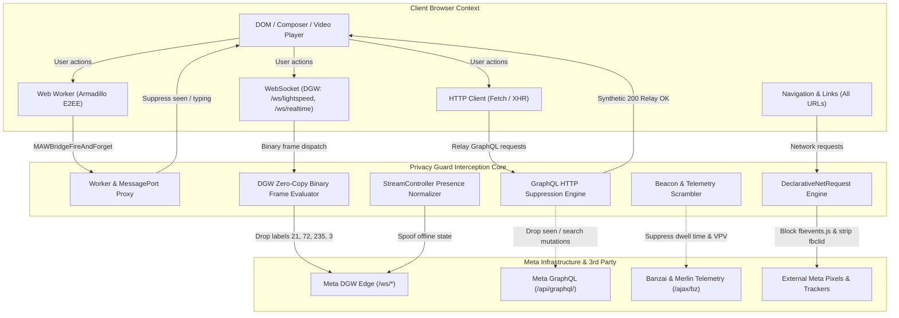

# Architecture & Protocol Interception

Privacy Guard uses a decoupled, event-driven defense-in-depth architecture to inspect, parse, and selectively suppress telemetry at the transport and runtime layer.

For more details on protocol signatures and mappings, see [Protocol Mapping Guide](PROTOCOL_MAPPING_GUIDE.md).
